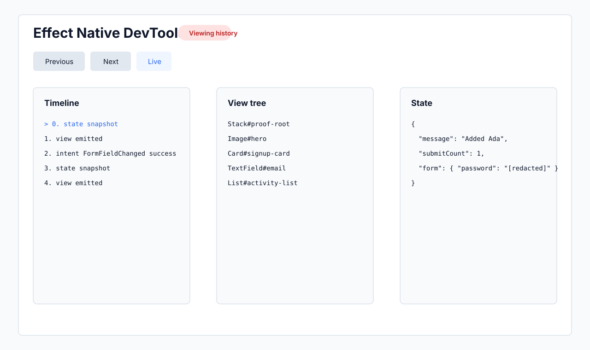

# DevTools v0

DevTools v0 is a local development tool built on Effect Native's public data
contracts. A runtime may provide a `DevtoolsSink`; without one, the normal app
path does not allocate DevTools events.

The sink receives:

- `StateSnapshot` events, after app-provided state redaction.
- `ViewEmitted` events, with secure `TextField` values redacted.
- `IntentDispatched` events, after the intent registry's redactor runs.

Recordings are JSON fixtures: initial state plus the timeline. They can be
serialized, loaded, replayed against a runtime, and replayed to an intent
prefix for time-travel.

## Local Relay

Start the browser panel and WebSocket relay:

```sh
pnpm run devtools
```

Attach the web proof example:

```sh
pnpm run example:web
```

Then open:

```text
http://localhost:4173/?devtools=ws://localhost:4327/session
```

Attach the Expo proof example by starting it with:

```sh
EXPO_PUBLIC_EFFECT_NATIVE_DEVTOOLS_WS=ws://localhost:4327/session pnpm --dir examples/mobile start
```

The panel is built with Effect Native itself. Its `devtoolsPanelView` is a
typed view tree rendered by the DOM renderer; the HTML shell and WebSocket
relay are only transport and bootstrapping.


