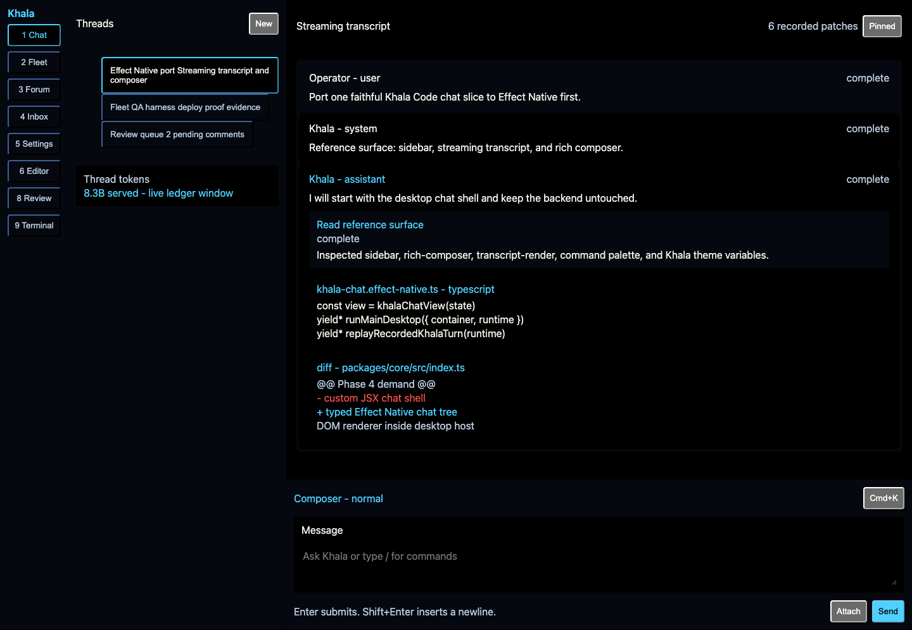
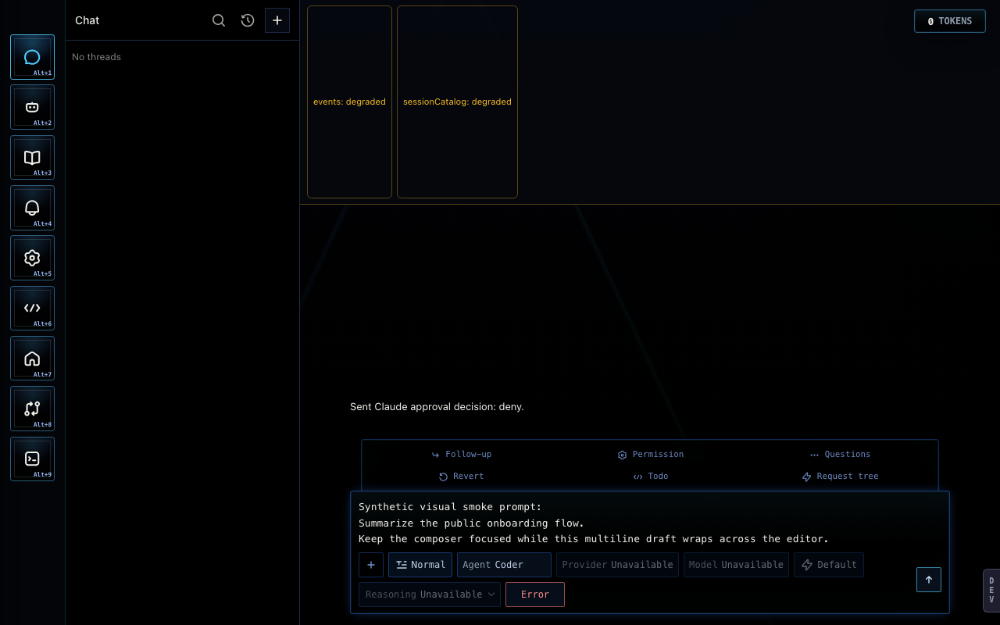
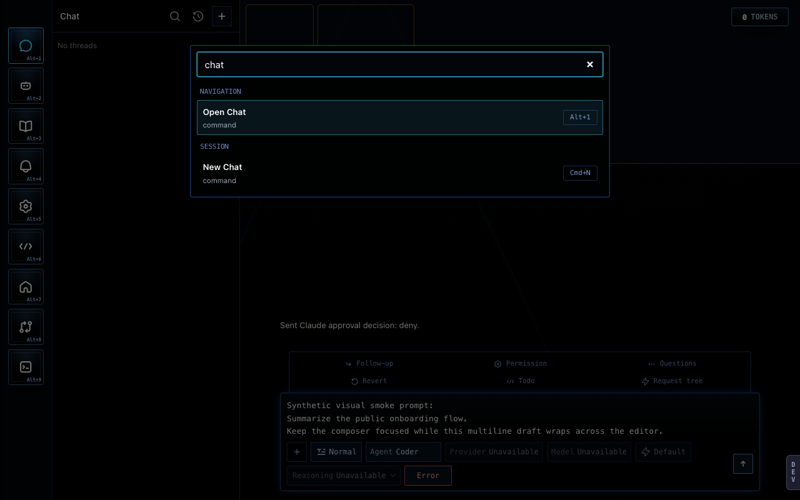

# Phase 4 Desktop Proof

The first Phase 4 proof is the Khala Code Desktop chat vertical slice. It is
not the full Khala shell cutover; it is the first milestone toward #42.

## What Is Defined Once

`examples/khala-chat/index.ts` owns the typed state schemas, intent
definitions, view tree, recorded stream patches, and runtime factory. The view
is built from Effect Native data only: no JSX screens, hooks, callbacks, or raw
DOM events appear in the public tree.

The slice includes:

- navigation rail and thread-list sidebar
- streaming transcript region
- role-styled messages
- tool-call card
- code block
- unified diff
- status indicators
- composer surface
- command palette surface
- **fleet cockpit** (`GraphFigure` + `Timeline` + run controls) when the fleet
  nav item is selected
- a settings strip with real form controls (`FieldRow` + `Toggle`)

This is the Phase 4 exit-receipt composition (#42): chat shell + fleet graph
from one typed tree, cross-renderer oracle + desktop host. Remaining owner
cutover (live Electrobun packaging, production screenshot bless) is operational
follow-through, not a missing catalog capability.

## Desktop Host

`@effect-native/platform-desktop` adds `runMainDesktop`, a typed
main/renderer bridge service, and headless Layer/test harnesses for:

- application menu
- window title/focus/fullscreen
- deep links
- single-instance events

The proof host at `examples/desktop-khala-chat/` mounts the DOM renderer through
`runMainDesktop`, using the Khala dark theme mapped from the exact OpenAgents
Khala design-token hex values.

## Oracle

`scripts/khala-chat-proof-oracle.test.ts` replays the same recorded turn patches
and scripted palette/composer interactions through:

- headless renderer
- DOM renderer
- React Native renderer

It asserts the same final state, intent log, and structural snapshots. This is
the behavioral receipt; screenshots are visual evidence.

## Screenshots

The committed proof and reference screenshots are:

| Effect Native proof                                                      | Running Khala reference                                                     | Khala palette reference                                                                                     |
| ------------------------------------------------------------------------ | --------------------------------------------------------------------------- | ----------------------------------------------------------------------------------------------------------- |
|  |  |  |

The Khala reference images were produced by the running
`openagents/clients/khala-code-desktop` composer visual smoke. Its committed
visual-baseline manifest currently reports those baselines as `missing`, so the
reference PNGs here are candidate captures from the running app rather than
owner-blessed baseline files.

## Run It

```sh
pnpm install
pnpm run check
pnpm run example:desktop-khala-chat
```

Then open `http://localhost:4174`.

To refresh the screenshot, run the example host and capture
`docs/assets/proof-desktop-khala-chat.png` at `1440x900`.

To refresh the reference images, run:

```sh
pnpm run --cwd ../openagents/clients/khala-code-desktop smoke:composer-visual
```

Then copy the desktop Khala screenshots from
`../openagents/clients/khala-code-desktop/var/khala-code-desktop/composer-visual-smoke/`.
