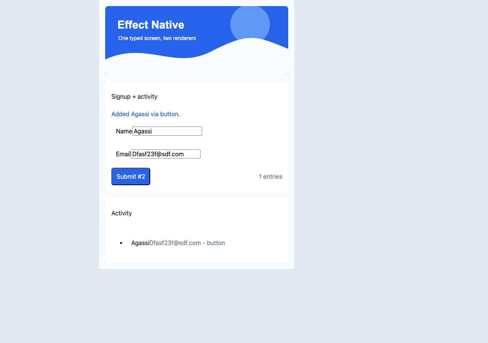
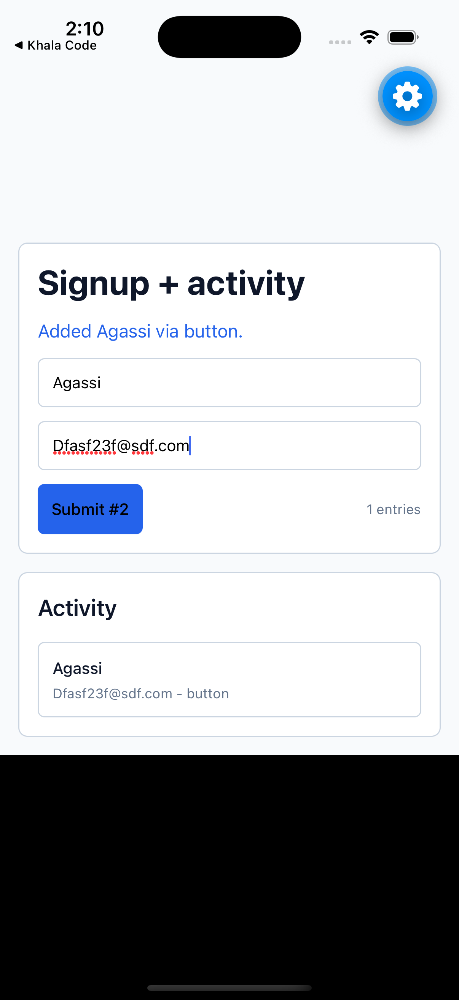

# Phase 1 Proof

One screen is defined once as typed Effect Native data in
`examples/signup-activity/index.ts`, then rendered by both priority hosts:

| Web                                             | Mobile                                                |
| ----------------------------------------------- | ----------------------------------------------------- |
|  |  |

See [Proof Screenshot Runbook](./screenshot-runbook.md) for the methodology
used to produce and update these images. The committed PNGs are actual browser
and iOS simulator captures. The older SVG receipts remain in `docs/assets/` as
a deprecated backup option when live bitmap capture is unavailable.

The shared module owns the state schema, Schema-backed `FormSpec`, view
function, intent definitions, handlers, and scripted proof steps. It imports
`effect` and
`@effect-native/core` only; it has no DOM, React, React Native, or Expo
imports. The web and mobile hosts are thin shells around that module.

## Run It

From a fresh clone:

```sh
pnpm install
pnpm run check
```

Run the web host:

```sh
pnpm run example:web
```

Then open `http://localhost:4173`.

Run the mobile host with the standard Expo flow:

```sh
cd examples/mobile
pnpm install
pnpm run ios
```

The mobile shell is intentionally bare. It supplies Expo, React, and React
Native as host dependencies, aliases the local workspace packages through
Metro, and embeds `EffectNativeSurface`.

## What The Oracle Checks

`scripts/proof-oracle.test.ts` replays the same interaction sequence against:

- the headless renderer,
- the DOM renderer under Happy DOM,
- the React Native renderer with an in-memory RN host shim.

For each renderer it asserts the same resulting state, the same intent log,
and structurally equivalent view snapshots after every step. The sequence
first attempts an invalid submit, proving mapped form errors and first-invalid
focus, then submits valid data through the same typed form state machine on
headless, DOM, and React Native. This is the Phase 1 receipt: behavior and
component structure match across web and mobile because both hosts consume the
same typed data.
