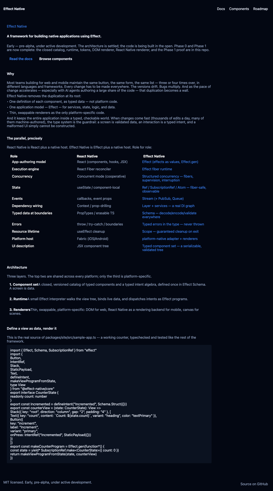
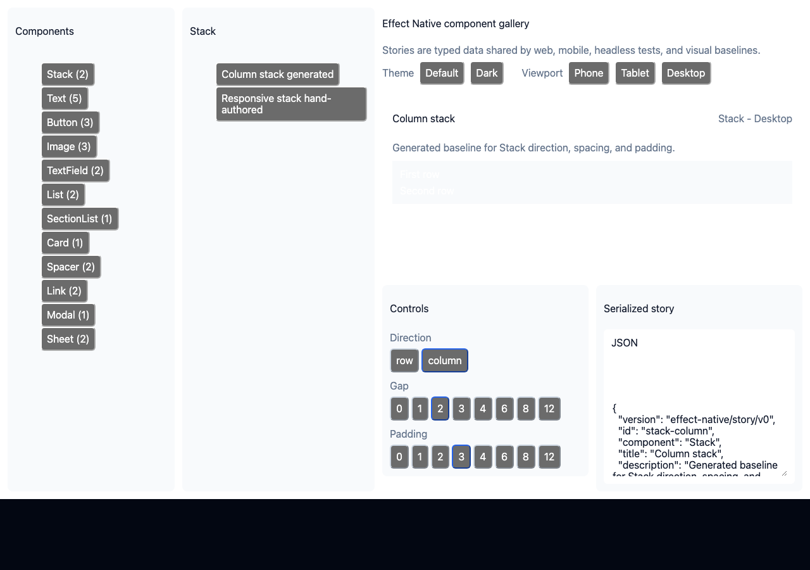
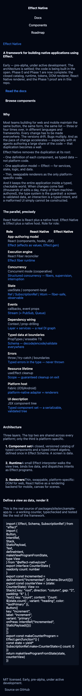
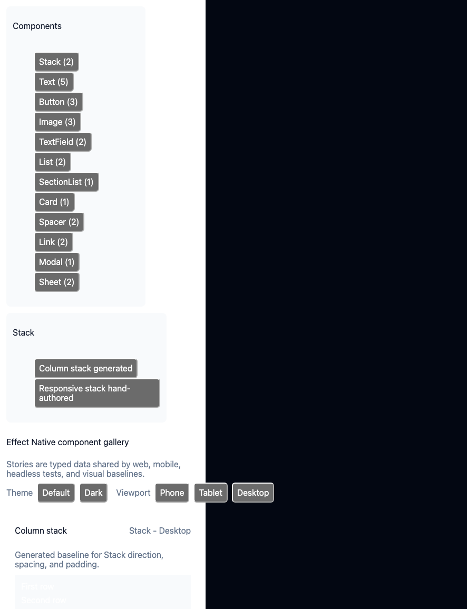

# effectnative.org

The framework's own website, built entirely with Effect Native: every page is
a `ViewProgram` from `@effect-native/site`, mounted by
`@effect-native/render-dom`, statically prerendered by that same renderer, and
hydrated in the browser by the same renderer again. No React, no hand-written
HTML pages, no static-site generator framework -- the site is the argument.

This document covers the source in this repository. **Hosting, DNS, and
deploy automation for effectnative.org are out of scope here** and tracked
downstream (issue `#8571` in the `openagents` repo); this repo's job ends at a
correct, complete `dist/site/` static artifact.

| Desktop, home | Desktop, components (`/components/`) |
|---|---|
|  |  |

| Phone, home | Phone, components (`/components/`) |
|---|---|
|  |  |

Captured with `bun run site` (the dev server) and Playwright at 1280x900
(desktop) and 390x844 (phone) against `/` and `/components/`.

## Structure

```
packages/site/src/
  content.ts               pure markdown/JSON parsers -- extracts repo-truth
                            content from README.md / ROADMAP.md / package.json
                            text without touching the filesystem (fixture-
                            testable)
  content-loader.node.ts   the one Node-only file: reads the real files with
                            node:fs and calls content.ts's parsers. Never
                            re-exported from index.ts, never imported by
                            browser-bundled code.
  pages.ts                 every page as a pure `(SiteContent, route) => View`
                            function -- home, docs index, the four doc pages,
                            roadmap/status, 404, plus the shared nav/footer
                            shell
  runtime.ts                the `ViewProgram`, `SiteState` (route + content),
                            and the `Navigate` intent handler that threads a
                            path change into both app state and a caller-
                            supplied `browserNavigate` effect
  sample-app.ts             a real, tiny, tested Effect Native app (a
                            counter). Its own source text is what the home
                            page displays as the "define a view as data,
                            render it" code sample, so that sample can never
                            silently rot into something that doesn't compile
  index.ts                  the package barrel (does not re-export
                            content-loader.node.ts)

examples/site/
  main.ts                   the browser host: boots `makeSiteRuntime`,
                             mounts with `makeDomRenderer`, wires
                             popstate <-> route sync and the
                             /components full-navigation special case
  server.ts                 a small dev server (SPA fallback for site
                             routes; passthrough to dist/gallery for
                             /components/*)
  public/index.html          the dev-mode HTML shell

scripts/
  generate-site-content.ts   writes packages/site/src/content.generated.json
                              from the real repo files (gitignored -- always
                              regenerated, never hand-edited or committed)
  build-site.ts               the static build: see "Prerender pipeline" below
  site-static-build.test.ts   runs `bun run site:build` and asserts on the
                                real output (curl-style fetches, version
                                threading, the gallery being reachable)

docs/website.md               this file
GAPS.md                       one new gap entry from this work: no
                               monospace/whitespace-preserving text style key
                               yet (worked around with one `Text` per source
                               line); related to the #36 CodeBlock gap
```

## Adding a page

1. Add a render function to `packages/site/src/pages.ts` (or a `docPageBody`
   entry if it's another short doc page) using only catalog components from
   `@effect-native/core`. If a real screen need surfaces a missing catalog
   capability, it goes through the normal `GAPS.md` growth process (see the
   repository root `GAPS.md`) -- do not reach for a one-off DOM/CSS escape
   hatch.
2. Add the route to `siteRoutePaths` (and `renderRoute`'s dispatch) so the
   client router and the prerender loop both pick it up automatically.
3. `bun run site` to preview locally; `bun run site:build` to confirm the
   static output.
4. Add or extend a `packages/site/test/pages.test.ts` case: every route in
   `siteRoutePaths` is asserted to `decodeView` successfully against the real
   catalog `ViewSchema`, so a malformed page fails `bun run check` immediately
   rather than shipping broken markup.

## The prerender pipeline

**Decision, recorded here per the issue's design constraint:** pages are
prerendered by mounting `@effect-native/render-dom`'s real `makeDomRenderer`
against a [`happy-dom`](https://github.com/capricorn86/happy-dom) `Window`,
the exact same headless-DOM technique the repository's own renderer and
oracle tests already rely on (`packages/render-dom/test/renderer.test.ts`,
`scripts/proof-oracle.test.ts`, `scripts/gallery-proof-oracle.test.ts`). We
did **not** add a new `renderToString` entry point to
`@effect-native/render-dom` for this issue: the site is currently the only
prerender call site, so growing the shared renderer package's public contract
for one caller was judged premature. If a second prerender consumer shows up,
promoting this into a first-class `renderToString(view, options)` export on
`@effect-native/render-dom` (with its own tests, as its own commit) is the
natural next step -- the mount-under-Happy-DOM-and-serialize approach used
here is exactly what that function would do internally.

`scripts/build-site.ts`:

1. Loads real content via `writeGeneratedSiteContentJson` (README.md,
   ROADMAP.md, package.json, and `sample-app.ts`'s own source), which also
   writes `packages/site/src/content.generated.json` -- the browser bundle's
   only way to see this content, since `content-loader.node.ts` itself is
   never bundled (see `test/dependency-boundary.test.ts`).
2. Bundles `examples/site/main.ts` to `dist/site/app.js` with `bun build`.
3. For every path in `siteRoutePaths`, creates a fresh `happy-dom` `Window`,
   sets `<title>`, `<meta name="description">`, Open Graph tags, and a
   favicon link, mounts the real `ViewProgram` for that route with
   `makeDomRenderer`, appends the `<script type="module" src="/app.js">` tag
   for client hydration, and serializes `document.documentElement.outerHTML`
   to `dist/site/<route>/index.html` (`dist/site/index.html` for `/`).
4. Renders and writes `dist/site/404.html` the same way, using an unknown
   route so `renderRoute` falls through to `renderNotFound`.
5. Writes `dist/site/favicon.svg` and `dist/site/sitemap.xml`.
6. Rebuilds the component gallery (`bun run gallery:build`, from issue `#18`)
   and copies `dist/gallery/` into `dist/site/components/` -- see "Embedding
   the gallery" below.

The output assumes it is served from the domain root: asset and route paths
in the generated HTML are root-absolute (`/app.js`, `/docs/`, ...). That
matches effectnative.org being a dedicated domain rather than a subpath
deployment.

## Embedding the gallery

**Decision:** `/components/` serves the gallery's own static build
(`dist/gallery/`, produced by `#18`'s `bun run gallery:build`) as a separate
bundle, copied wholesale into `dist/site/components/`, rather than iframing it
or re-implementing gallery routing inside the site's own SPA state. The
gallery already ships a subpath-safe static build specifically so it can be
served from a nested path like this (see `docs/gallery.md`); reusing that
contract is simpler and more robust than teaching the site's router about
story URLs.

Because of this, `/components` is a real browser navigation, not a
client-side route change: `packages/site/src/pages.ts`'s `componentsPath` is
deliberately **not** included in `siteRoutePaths`, and
`packages/site/src/runtime.ts`'s `Navigate` handler only updates internal
`route` state for paths in that known-route set. `examples/site/main.ts`
special-cases any `path` destination starting with `/components` to call
`window.location.assign` (a full page load) instead of the default
`pushState`-based in-app navigation, so the browser genuinely loads the
gallery's own bundle. This is ordinary, supported use of the framework's
pluggable `NavigationHandler` -- not a catalog bypass.

The site and the gallery also share one look: `examples/site/main.ts` and
`scripts/build-site.ts` both reuse the gallery's existing dark `Theme` export
(`galleryThemes.find(t => t.id === "dark")`) rather than defining a second
dark palette.

## Content honesty and freshness

- The home page's tagline, "why" paragraphs, the React Native / Effect Native
  role table, and the roadmap/status page's phase list and version are all
  parsed from the real `README.md`, `ROADMAP.md`, and `package.json` at build
  time (`packages/site/src/content.ts`'s `parseSiteContent`, loaded by
  `content-loader.node.ts`). They cannot drift from those files without the
  extraction itself changing. `packages/site/test/content.test.ts` includes a
  fixture test that bumps a fixture package/README version and asserts the
  parsed -- and separately, the *rendered roadmap view* -- output changes.
- The home-page code sample is the literal source of `sample-app.ts`, a real
  file that is typechecked and exercised by `test/sample-app.test.ts`.
- The "your first app" and "styling" doc pages are original short overviews
  (not generated), since they're not mirroring an existing source file; the
  docs index links out to the full [`docs/guide/`](./guide/README.md) (`#17`,
  shipped) rather than claiming to be that guide.
- The "thinking in Effect Native" and "why typed UI matters" doc pages reuse
  the same generated role table and AI-authored-software paragraphs as the
  home page -- one source of truth, not a second copy.
- No fabricated logos, testimonials, or stats anywhere on the site. The
  roadmap page's status line and phase list come straight from the parsed
  `ROADMAP.md`/`README.md` "Status" section.

## Build / local dev

```sh
bun run site           # dev server at http://localhost:4176 (SPA, live app.js)
bun run site:build     # static output at dist/site/
bun run site:content   # regenerate packages/site/src/content.generated.json only
```

`bun run site:build` also rebuilds the gallery and copies it in, so a single
command produces the complete artifact. Serve `dist/site/` from any static
host with this fallback contract (reference implementation:
`scripts/site-static-build.test.ts`'s `makeStaticServer`):

- an exact file match (`/docs/first-app/index.html`, `/app.js`, ...) serves
  as-is;
- an extensionless path under `/components` that has no exact file falls back
  to `components/index.html` (the gallery's own SPA shell, `200` -- the same
  subpath contract `docs/gallery.md` documents);
- any other extensionless path with no exact file falls back to `404.html`
  served with a `404` status, not `200`.

## Non-goals (unchanged from the issue)

- Hosting, DNS, TLS, deploy automation for effectnative.org.
- A full in-site docs engine, search, or versioned docs.
- Blog, newsletter, analytics, i18n.
